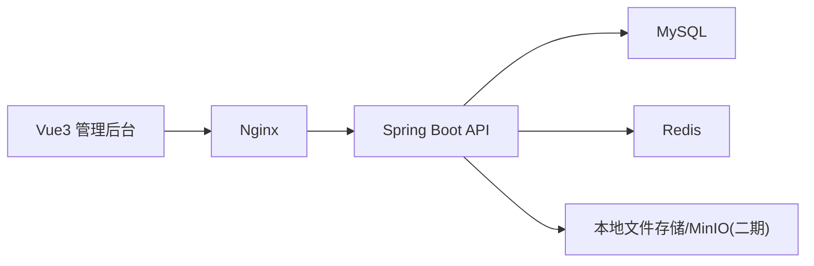
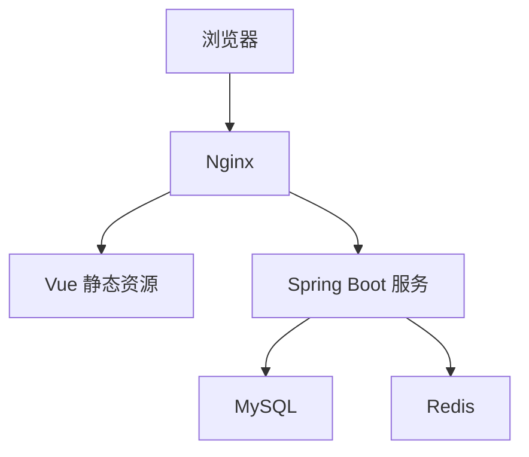

# 房源管理系统实施技术方案

## 1. 项目定位

本项目定位为一个前后端分离的 B 端后台管理系统，业务上参考全房通的核心能力，但首期目标不做过深的财务、合同审批、消息通知和复杂报表，而是先完成一个可演示、可上线、可写进简历的简化版房源管理平台。

项目目标：

- 完成一个标准的前后端分离后台项目，体现你从前端向全栈延伸的能力。
- 核心业务覆盖登录、首页、整租管理、合租管理、集中管理、租客登记、房东登记、员工管理、员工授权、维修管理、保洁管理。
- 架构上预留组织隔离、权限控制、日志审计、附件上传等扩展位，便于后续叠加 AI 知识库系统。
- 控制项目范围，优先完成 MVP，可在 6 到 10 周内由一人独立交付。

说明：

- 你提到的“整合集里面有登记租客、登记房东”，本文按“基础资料管理”理解，即租客资料和房东资料作为独立基础档案模块管理。

## 2. MVP 范围与版本规划

### 2.1 MVP 必做功能

1. 登录与退出
2. 首页看板
3. 整租管理
4. 合租管理
5. 集中管理
6. 租客登记
7. 房东登记
8. 员工管理
9. 员工授权
10. 维修工单管理
11. 保洁工单管理
12. 菜单权限与按钮权限控制

### 2.2 二期可扩展功能

1. 合同管理
2. 收租提醒
3. 报修评价
4. 房态时间轴
5. 导入导出
6. 操作日志
7. 数据大屏
8. 多组织隔离

## 3. 推荐技术选型

### 3.1 前端

- Vue 3
- Vite
- Pinia
- Vue Router
- Element Plus
- ECharts
- Axios
- Sass

### 3.2 后端

- Java 17
- Spring Boot 3.x
- Spring Web
- Spring Security
- JWT
- MyBatis-Plus
- MySQL 8
- Redis
- Hibernate Validator
- Knife4j 或 SpringDoc OpenAPI

### 3.3 工程与部署

- Maven
- Docker / Docker Compose
- Nginx
- Git

### 3.4 选型建议

对于第一个项目，不建议一开始做微服务。建议采用“前后端分离 + 单体后端 + 清晰模块化”模式。

原因：

1. 更适合个人项目快速起量。
2. 能把精力集中在业务建模、权限、接口设计和页面交互上。
3. 对求职展示来说，单体架构并不扣分，关键在于模块划分是否清晰、业务是否完整。

## 4. 总体架构



### 4.1 架构说明

- 前端负责页面渲染、权限路由、表单校验、图表展示。
- 后端负责登录鉴权、业务规则、数据持久化、权限校验、缓存。
- Redis 用于登录态缓存、验证码、热点字典缓存、接口幂等控制扩展。
- 文件存储首期可以使用本地磁盘目录，二期若有附件和图片上传需求可替换为 MinIO。

## 5. 推荐目录规划

结合你当前工作区结构，建议这样组织：

```text
all-project/
  frontend/
    house-admin/
  backend/
    house-service/
  career-docs/
```

### 5.1 前端目录建议

```text
frontend/house-admin/
  src/
    api/
    assets/
    components/
    directives/
    hooks/
    layout/
    router/
    stores/
    styles/
    utils/
    views/
      login/
      dashboard/
      housing/
        whole-rent/
        shared-rent/
        centralized/
      customer/
        tenant/
        landlord/
      workorder/
        maintenance/
        cleaning/
      system/
        employee/
        role/
        menu/
```

### 5.2 后端目录建议

```text
backend/house-service/
  src/main/java/com/example/house/
    common/
    config/
    auth/
    modules/
      dashboard/
      housing/
      tenant/
      landlord/
      employee/
      role/
      permission/
      maintenance/
      cleaning/
      file/
      log/
```

## 6. 核心业务模块拆解

### 6.1 登录与权限

功能点：

- 用户登录
- 退出登录
- 获取当前登录人信息
- 动态菜单
- 按钮权限
- Token 失效处理

实现建议：

- 使用 `Spring Security + JWT + Redis`。
- 登录成功后返回 `accessToken`、用户信息、角色信息。
- 前端登录后拉取用户菜单树，按菜单动态注册路由。
- 按钮权限使用 `permission code` 控制，例如 `house:add`、`tenant:edit`。

### 6.2 首页看板

建议展示指标：

- 房源总数
- 空置房源数
- 在租房源数
- 本月新增租客
- 待处理维修工单
- 待处理保洁工单
- 不同房型占比
- 房源出租率趋势

ECharts 图表建议：

1. 柱状图：整租/合租/集中式房源数量对比
2. 折线图：近 7 天新增租客趋势
3. 饼图：房源状态分布

### 6.3 整租管理

字段建议：

- 房源编号
- 房源名称
- 所属小区
- 详细地址
- 楼栋
- 单元
- 楼层
- 户型
- 面积
- 朝向
- 月租金
- 押金
- 房源状态
- 所属房东
- 备注

功能点：

1. 新增房源
2. 编辑房源
3. 查看详情
4. 上架/下架
5. 状态筛选
6. 关联租客

### 6.4 合租管理

合租的关键点在于“一个房源下有多个房间”。建议采用统一房源主表 + 房间子表的模式。

结构建议：

- 房源主表记录整套房屋信息
- 房间表记录 A 室、B 室、C 室等分间信息
- 每个房间可以绑定一个租客和租住状态

功能点：

1. 新增合租房源
2. 为房源新增多个房间
3. 查看各房间出租状态
4. 房间级别租客绑定
5. 房间级别租金设置

### 6.5 集中管理

集中管理适合理解为“集中式公寓 / 托管公寓 / 批量房源项目”。

建议实体：

- 项目
- 楼栋
- 房间

功能点：

1. 新增项目
2. 项目下维护楼栋
3. 楼栋下维护房间
4. 按项目查看出租率
5. 按项目筛选维修和保洁工单

### 6.6 租客登记

字段建议：

- 姓名
- 手机号
- 身份证号
- 性别
- 紧急联系人
- 联系方式
- 租住开始时间
- 租住结束时间
- 关联房源
- 备注

功能点：

1. 新增租客
2. 编辑租客
3. 查看租客关联房源
4. 查看历史租住记录

### 6.7 房东登记

字段建议：

- 姓名
- 手机号
- 身份证号或统一社会信用代码
- 银行卡信息
- 联系地址
- 备注

功能点：

1. 新增房东
2. 编辑房东
3. 查看房东名下房源
4. 统计房东房源数

### 6.8 员工管理

字段建议：

- 员工编号
- 姓名
- 手机号
- 邮箱
- 部门
- 岗位
- 状态
- 角色

功能点：

1. 员工新增
2. 员工编辑
3. 启用/禁用
4. 分配角色
5. 重置密码

### 6.9 员工授权

建议采用 RBAC 模型：

- 用户
- 角色
- 权限
- 菜单

权限颗粒度：

1. 菜单可见权限
2. 页面按钮权限
3. 数据操作权限

MVP 阶段先做前两项即可。

### 6.10 维修管理

字段建议：

- 工单编号
- 房源
- 报修类型
- 问题描述
- 报修人
- 指派人
- 优先级
- 状态
- 创建时间
- 完成时间

状态建议：

- 待处理
- 处理中
- 已完成
- 已关闭

### 6.11 保洁管理

字段建议：

- 工单编号
- 房源
- 保洁类型
- 预约时间
- 指派人
- 状态
- 备注

状态建议：

- 待分配
- 已分配
- 已完成
- 已取消

## 7. 领域建模建议

为了兼顾简单实现与后续扩展，建议采用“统一房源主模型 + 按业务类型展示”的思路。

### 7.1 统一核心实体

1. 组织 `org`
2. 用户 `sys_user`
3. 角色 `sys_role`
4. 权限 `sys_permission`
5. 菜单 `sys_menu`
6. 房东 `landlord`
7. 租客 `tenant`
8. 房源主表 `house`
9. 房间表 `house_room`
10. 维修工单 `maintenance_order`
11. 保洁工单 `cleaning_order`

### 7.2 房源主表设计建议

`house` 关键字段：

- `id`
- `org_id`
- `house_code`
- `house_name`
- `rental_mode`，取值建议：`WHOLE`、`SHARED`、`CENTRALIZED`
- `project_name`
- `community_name`
- `address`
- `building_no`
- `unit_no`
- `floor_no`
- `room_no`
- `layout_desc`
- `area`
- `rent_price`
- `deposit_price`
- `status`
- `landlord_id`
- `created_by`
- `created_at`
- `updated_at`
- `deleted`

### 7.3 房间表设计建议

`house_room` 关键字段：

- `id`
- `house_id`
- `room_code`
- `room_name`
- `room_area`
- `rent_price`
- `status`
- `tenant_id`
- `checkin_date`
- `checkout_date`

说明：

- 整租模式下可以不需要房间表。
- 合租和集中式模式建议使用房间表。

## 8. 数据库表清单建议

### 8.1 系统表

1. `sys_user`
2. `sys_role`
3. `sys_user_role`
4. `sys_menu`
5. `sys_role_menu`
6. `sys_permission`
7. `sys_role_permission`
8. `sys_login_log`
9. `sys_operation_log`

### 8.2 业务表

1. `landlord`
2. `tenant`
3. `house`
4. `house_room`
5. `tenant_house_relation`
6. `maintenance_order`
7. `cleaning_order`
8. `file_attachment`

### 8.3 推荐公共字段

所有业务表尽量统一包含：

- `id`
- `org_id`
- `created_by`
- `created_at`
- `updated_by`
- `updated_at`
- `deleted`

这样后期做组织隔离、审计和回收站会更轻松。

## 9. 接口设计建议

接口统一前缀建议：`/api`

### 9.1 登录鉴权

- `POST /api/auth/login`
- `POST /api/auth/logout`
- `GET /api/auth/profile`
- `GET /api/auth/menus`

### 9.2 首页

- `GET /api/dashboard/overview`
- `GET /api/dashboard/trend`

### 9.3 房源管理

- `GET /api/houses`
- `POST /api/houses`
- `PUT /api/houses/{id}`
- `GET /api/houses/{id}`
- `DELETE /api/houses/{id}`
- `PUT /api/houses/{id}/status`

### 9.4 房间管理

- `GET /api/houses/{houseId}/rooms`
- `POST /api/houses/{houseId}/rooms`
- `PUT /api/rooms/{id}`
- `DELETE /api/rooms/{id}`

### 9.5 租客与房东

- `GET /api/tenants`
- `POST /api/tenants`
- `PUT /api/tenants/{id}`
- `GET /api/landlords`
- `POST /api/landlords`
- `PUT /api/landlords/{id}`

### 9.6 员工与权限

- `GET /api/employees`
- `POST /api/employees`
- `PUT /api/employees/{id}`
- `PUT /api/employees/{id}/status`
- `POST /api/roles`
- `PUT /api/roles/{id}`
- `GET /api/menus/tree`

### 9.7 工单

- `GET /api/maintenance-orders`
- `POST /api/maintenance-orders`
- `PUT /api/maintenance-orders/{id}`
- `GET /api/cleaning-orders`
- `POST /api/cleaning-orders`
- `PUT /api/cleaning-orders/{id}`

## 10. 前端实现方案

### 10.1 页面形态建议

后台页面建议统一以下模式：

1. 筛选区
2. 操作区
3. 表格区
4. 分页区
5. 弹窗或抽屉表单

这种模式非常适合 Element Plus，可以快速出业务效果。

### 10.2 组件复用建议

可以抽出以下通用组件：

1. 通用分页表格组件
2. 通用查询表单组件
3. 字典标签组件
4. 图片/附件预览组件
5. 权限按钮组件

### 10.3 Pinia 状态管理建议

至少拆出以下 store：

1. `userStore`：用户信息、token、角色、权限
2. `permissionStore`：菜单树、动态路由
3. `dictStore`：字典缓存
4. `appStore`：侧边栏折叠、主题、标签页

### 10.4 路由建议

一级菜单建议：

1. 首页
2. 房源管理
3. 基础资料
4. 工单管理
5. 系统管理

二级菜单建议：

- 房源管理
- 整租管理
- 合租管理
- 集中管理
- 基础资料
- 租客管理
- 房东管理
- 工单管理
- 维修管理
- 保洁管理
- 系统管理
- 员工管理
- 角色管理
- 菜单管理

### 10.5 接口请求封装建议

统一封装：

- 请求拦截器：自动带 token
- 响应拦截器：统一处理 401、403、500
- 分页参数封装
- 下载文件封装

## 11. 后端实现方案

### 11.1 分层建议

采用标准分层：

1. Controller
2. Service
3. Mapper
4. Entity
5. DTO / VO

### 11.2 认证授权建议

1. 登录时校验用户名密码
2. 生成 JWT
3. Redis 缓存用户登录信息和权限快照
4. 每次请求由过滤器解析 token
5. 接口通过注解或权限码判断访问权限

### 11.3 统一返回结构

建议统一为：

```json
{
  "code": 0,
  "message": "success",
  "data": {}
}
```

分页结构建议：

```json
{
  "code": 0,
  "message": "success",
  "data": {
    "list": [],
    "total": 0,
    "pageNum": 1,
    "pageSize": 10
  }
}
```

### 11.4 数据权限建议

MVP 可先不做复杂数据权限，只保留以下扩展位：

- `org_id` 做组织隔离
- `created_by` 做本人数据扩展
- `dept_id` 预留部门权限扩展

### 11.5 缓存建议

Redis 可用于：

1. Token 登录态
2. 用户菜单缓存
3. 字典数据缓存
4. 首页统计缓存

## 12. 首页统计口径建议

建议后端统一提供聚合接口，不要前端自己拼装多个接口。

例如：

- 房源总数
- 在租数
- 空置数
- 本月新增租客
- 待处理维修数
- 待处理保洁数

这样首页只调用一个概览接口和一个趋势接口即可。

## 13. 开发顺序建议

### 第 1 阶段：工程搭建

1. 前端初始化
2. 后端初始化
3. 登录鉴权
4. 菜单路由
5. 基础布局

### 第 2 阶段：系统管理

1. 员工管理
2. 角色管理
3. 菜单管理
4. 权限控制

### 第 3 阶段：基础资料

1. 租客管理
2. 房东管理

### 第 4 阶段：房源管理

1. 整租管理
2. 合租管理
3. 集中管理

### 第 5 阶段：工单与首页

1. 维修管理
2. 保洁管理
3. 首页图表

### 第 6 阶段：完善与部署

1. 接口文档
2. 操作日志
3. Docker 部署
4. 简历项目总结

## 14. 独立开发周期建议

如果你是边工作边做，建议按 8 周节奏：

1. 第 1 周：搭建前后端骨架、登录、布局
2. 第 2 周：员工、角色、菜单权限
3. 第 3 周：租客、房东模块
4. 第 4 周：整租管理
5. 第 5 周：合租管理
6. 第 6 周：集中管理
7. 第 7 周：维修、保洁、首页图表
8. 第 8 周：联调、优化、部署、项目文档整理

## 15. 部署方案建议

### 15.1 部署拓扑



### 15.2 Docker Compose 建议服务

1. `nginx`
2. `house-admin`
3. `house-service`
4. `mysql`
5. `redis`

## 16. 项目亮点建议

这个项目完成后，简历可以突出以下亮点：

1. 独立完成前后端分离后台系统设计与开发
2. 实现 RBAC 权限模型、动态路由、按钮级权限控制
3. 基于 Vue3 + Spring Boot 完成房源、租客、房东、工单等核心业务
4. 使用 ECharts 实现运营看板
5. 通过 Redis 优化登录态与热点数据查询

## 17. 与第二个 AI 知识库项目的衔接点

第一个系统完成后，建议沉淀以下内容，作为第二个 AI 知识库系统的数据来源：

1. 系统菜单说明文档
2. 业务操作 SOP
3. 常见问题 FAQ
4. 接口文档
5. 员工培训手册
6. 维修和保洁流程说明

这样第二个项目就不是“空做一个 AI 页面”，而是围绕真实业务系统构建知识问答能力，项目叙事会更完整。

## 18. 最终建议

第一个项目最重要的不是把业务做得无限大，而是做到“结构清晰、权限完整、页面规范、接口可联调、数据库设计合理”。  
对于你当前转向全栈的目标来说，这个项目足以作为主作品。建议先把这个系统做成一个可演示版本，再进入 AI 知识库项目。
