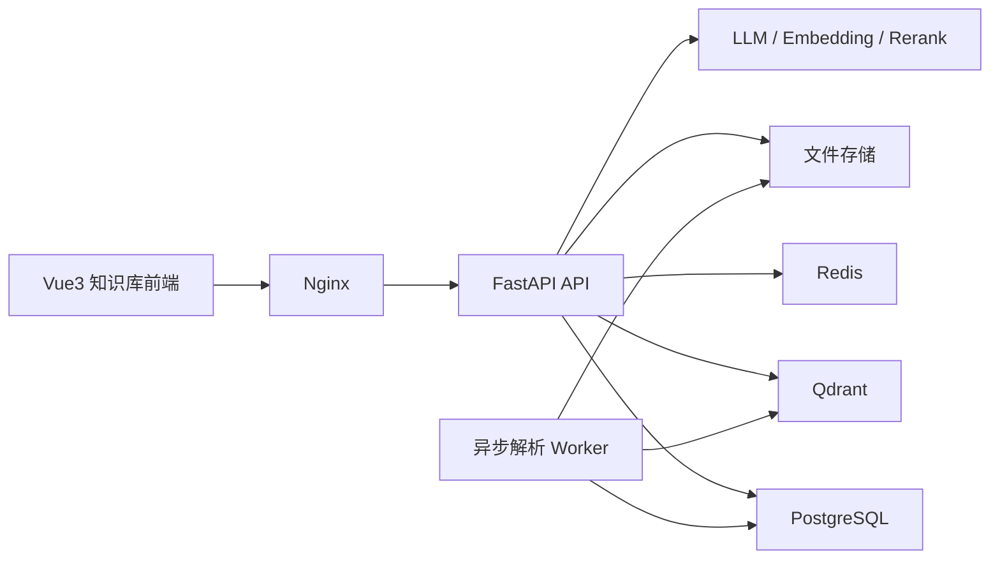

# AI Agent 知识库系统实施技术方案

## 1. 项目定位

本项目定位为“面向房源管理系统的 AI 知识库问答平台”，第一阶段核心不是做复杂自治 Agent，而是先把一个可用的 RAG 知识库系统做扎实，支持文档上传、解析、切片、检索问答、引用来源、权限隔离、会话管理和流式输出。

项目目标：

- 为第一个房源管理系统提供智能检索和问答能力。
- 能回答“某个功能怎么用”“某个业务流程怎么走”“某个菜单在哪里”“报修流程是什么”等常见问题。
- 技术上覆盖前端、Python 后端、向量检索、流式输出、权限控制、容器化部署。
- 为后续升级成真正的 AI Agent 打下基础，例如工具调用、任务执行、工单助手、SQL 查询助手。

## 2. 建议实施策略

建议分两步走：

### 2.1 第一步：先做 RAG 知识库

必须完成：

1. 登录
2. 知识库空间
3. PDF / Word 上传
4. 文档解析
5. 文档切片
6. 向量化入库
7. 检索问答
8. 引用来源
9. 会话管理
10. 流式输出
11. 权限隔离

### 2.2 第二步：再加 Agent 能力

可在二期加入：

1. 工具调用
2. 业务 API 联动
3. 智能表单填充
4. 常见流程自动引导
5. 工单助手
6. SQL 查询助手

这样做的好处是项目路径更稳，不会一开始就被“Agent”概念拖得过重。

## 3. 技术栈建议

### 3.1 前端

- Vue 3
- JavaScript
- Vite
- Pinia
- Vue Router
- Element Plus
- Axios

### 3.2 后端

- Python 3.11
- FastAPI
- Pydantic
- SQLAlchemy
- Alembic
- Celery 或 FastAPI BackgroundTasks

### 3.3 数据与基础设施

- PostgreSQL
- Redis
- 向量库：Qdrant
- 文件存储：本地磁盘目录，二期可替换 MinIO
- Docker / Docker Compose

### 3.4 大模型与嵌入模型

建议采用“模型适配层”设计，不把实现绑死在某一家平台上。

抽象出三类能力：

1. Chat 模型
2. Embedding 模型
3. Rerank 模型

推荐思路：

- Chat 模型支持 OpenAI 兼容接口、阿里百炼、硅基流动、DeepSeek、Qwen 等。
- Embedding 可先使用中文效果较好的通用向量模型。
- Rerank 首期可选做，若接入后能明显提升问答质量。

## 4. 总体架构



### 4.1 架构说明

- 前端负责知识库管理、文档上传、对话页面、来源展示。
- FastAPI 提供鉴权、文档管理、检索、会话管理、流式输出接口。
- PostgreSQL 存储用户、知识库、文档、切片元数据、会话消息等结构化数据。
- Redis 用于队列、缓存、会话上下文加速。
- Qdrant 存储向量索引。
- Worker 负责文档解析、切片、向量化和重建索引。

## 5. 与房源管理系统的关系

这个项目不是孤立存在的，应该围绕第一个系统的真实资料来构建。

### 5.1 推荐知识来源

1. 房源管理系统需求文档
2. 菜单说明文档
3. 操作手册
4. 常见问题 FAQ
5. 培训资料
6. 接口文档
7. 维修流程与保洁流程文档

### 5.2 未来联动方向

1. 从房源系统同步员工身份与权限
2. 按角色限制知识库访问范围
3. 在房源系统内嵌一个“智能帮助”入口
4. 基于菜单上下文推荐相关帮助内容

## 6. 推荐目录规划

建议在当前工作区继续扩展为：

```text
all-project/
  frontend/
    house-admin/
    ai-kb-web/
  backend/
    house-service/
    ai-kb-service/
  career-docs/
```

### 6.1 前端目录建议

```text
frontend/ai-kb-web/
  src/
    api/
    assets/
    components/
      chat/
      kb/
      upload/
      citation/
    router/
    stores/
    utils/
    views/
      login/
      dashboard/
      kb-space/
      document/
      chat/
      setting/
```

### 6.2 后端目录建议

```text
backend/ai-kb-service/
  app/
    api/
    core/
    db/
    models/
    schemas/
    services/
      auth/
      document/
      parser/
      chunk/
      embedding/
      retrieval/
      chat/
    workers/
```

## 7. 核心功能模块拆解

### 7.1 登录与权限

首期建议单独实现登录系统，后期再考虑与房源管理系统统一单点登录。

功能点：

1. 用户登录
2. 获取个人信息
3. 获取可访问的知识库空间
4. 按空间、文档、会话做权限隔离

### 7.2 知识库空间管理

知识库空间可以理解为一个逻辑隔离容器，例如：

- 房源系统帮助中心
- 员工培训资料库
- 维修 SOP 知识库
- 保洁 SOP 知识库

功能点：

1. 新建知识库空间
2. 编辑知识库空间
3. 分配可访问成员
4. 查看空间文档数和切片数

### 7.3 文档上传

支持格式：

1. PDF
2. DOCX

首期建议先做好 PDF 和 DOCX，不必急着加 Excel、PPT 和图片 OCR。

功能点：

1. 上传文件
2. 记录文件元信息
3. 校验格式与大小
4. 上传后进入待解析状态

### 7.4 文档解析

解析流程：

1. 接收文件
2. 提取文本
3. 按标题与段落结构清洗
4. 生成文档页码和段落信息
5. 保存解析结果

建议库：

- PDF：`PyMuPDF`
- Word：`python-docx`
- 通用清洗：自定义规则

### 7.5 知识切片

切片目标不是简单按字数切，而是尽量保留语义完整性。

建议策略：

1. 先按标题分块
2. 再按段落切片
3. 对超长段落按长度二次切分
4. 保留重叠内容

建议参数：

- 中文切片长度：`500` 到 `800` 字
- 重叠长度：`100` 到 `150` 字

切片需要保存：

- 文档 ID
- 段落内容
- 页码
- 标题路径
- 序号
- token 长度估算

### 7.6 向量化与索引

处理流程：

1. 对切片内容生成 embedding
2. 写入向量库
3. PostgreSQL 保存切片元数据
4. 保存向量库中的 `point_id`

建议不要把全文内容只放在向量库里，结构化元数据仍然要保存在 PostgreSQL。

### 7.7 检索问答

推荐采用“混合检索 + 重排 + 上下文拼装”的方案。

流程建议：

1. 用户提问
2. 生成查询向量
3. 向量召回 TopK
4. 可选关键词召回
5. 融合候选结果
6. Rerank 重排
7. 拼装上下文
8. 调用大模型生成答案
9. 返回引用来源

### 7.8 引用来源

这是知识库系统和普通聊天页面差异很大的一个亮点能力。

每次回答建议返回：

1. 来源文档名称
2. 页码
3. 片段摘要
4. 命中相似度

前端可以展示为“答案 + 引用卡片”的组合形式。

### 7.9 会话管理

功能点：

1. 创建会话
2. 重命名会话
3. 删除会话
4. 查看历史消息
5. 按知识库空间过滤会话

建议会话和知识库空间绑定，避免混淆上下文。

### 7.10 流式输出

建议使用 `SSE` 实现流式输出。

原因：

1. 对文本问答场景足够稳定
2. 前端实现简单
3. 比 WebSocket 更轻量

返回内容建议拆成：

1. token 增量内容
2. 引用来源
3. 消息完成事件
4. 错误事件

## 8. 权限隔离设计

权限隔离是这个系统的关键卖点之一。

### 8.1 隔离维度

1. 用户隔离
2. 角色隔离
3. 知识库空间隔离
4. 文档可见范围隔离

### 8.2 实现建议

最简单可行的模型：

- 用户属于某个组织
- 用户拥有一个或多个角色
- 知识库空间配置可访问成员或角色
- 文档归属某个知识库空间
- 检索时仅在当前用户可访问空间内搜索

### 8.3 与第一个系统的衔接建议

后期可以直接复用房源系统中的：

1. 用户表
2. 角色表
3. 组织表

这样两个项目之间就有非常自然的系统联动。

## 9. 数据模型建议

### 9.1 用户与权限相关

1. `user`
2. `role`
3. `user_role`
4. `knowledge_space`
5. `knowledge_space_member`

### 9.2 文档相关

1. `document`
2. `document_parse_result`
3. `document_chunk`
4. `document_chunk_embedding`

说明：

- 如果向量放在 Qdrant，则 `document_chunk_embedding` 可以只保存 `chunk_id` 和 `vector_point_id` 映射。

### 9.3 会话相关

1. `conversation`
2. `conversation_message`
3. `conversation_citation`

### 9.4 推荐核心字段

`knowledge_space`：

- `id`
- `name`
- `description`
- `org_id`
- `created_by`
- `created_at`

`document`：

- `id`
- `space_id`
- `file_name`
- `file_type`
- `file_size`
- `storage_path`
- `parse_status`
- `chunk_count`
- `created_by`
- `created_at`

`document_chunk`：

- `id`
- `document_id`
- `space_id`
- `chunk_index`
- `content`
- `content_preview`
- `page_no`
- `section_path`
- `token_estimate`

`conversation`：

- `id`
- `space_id`
- `user_id`
- `title`
- `created_at`
- `updated_at`

`conversation_message`：

- `id`
- `conversation_id`
- `role`
- `content`
- `model_name`
- `prompt_tokens`
- `completion_tokens`
- `created_at`

## 10. 接口设计建议

接口统一前缀建议：`/api`

### 10.1 登录与用户

- `POST /api/auth/login`
- `GET /api/auth/profile`
- `GET /api/auth/spaces`

### 10.2 知识库空间

- `GET /api/spaces`
- `POST /api/spaces`
- `PUT /api/spaces/{id}`
- `GET /api/spaces/{id}`
- `POST /api/spaces/{id}/members`

### 10.3 文档管理

- `GET /api/documents`
- `POST /api/documents/upload`
- `GET /api/documents/{id}`
- `DELETE /api/documents/{id}`
- `POST /api/documents/{id}/parse`
- `GET /api/documents/{id}/chunks`

### 10.4 检索与问答

- `POST /api/retrieval/search`
- `POST /api/chat/conversations`
- `GET /api/chat/conversations`
- `GET /api/chat/conversations/{id}/messages`
- `POST /api/chat/conversations/{id}/messages`
- `GET /api/chat/conversations/{id}/stream`

### 10.5 管理能力

- `GET /api/models`
- `PUT /api/settings/model`
- `GET /api/statistics/overview`

## 11. 前端实现方案

### 11.1 页面结构建议

一级菜单建议：

1. 工作台
2. 知识库空间
3. 文档中心
4. 智能问答
5. 系统设置

### 11.2 核心页面建议

`知识库空间` 页面：

- 空间列表
- 空间成员管理
- 文档数量统计

`文档中心` 页面：

- 上传文件
- 文档列表
- 解析状态
- 切片数量
- 失败原因

`智能问答` 页面：

- 左侧会话列表
- 中间聊天区
- 右侧引用来源区

### 11.3 前端组件建议

1. 聊天气泡组件
2. 流式渲染组件
3. 引用来源卡片组件
4. 上传拖拽组件
5. 文档状态标签组件

### 11.4 状态管理建议

1. `userStore`
2. `spaceStore`
3. `chatStore`
4. `documentStore`
5. `settingStore`

## 12. 后端实现方案

### 12.1 服务拆分建议

建议按职责拆服务，而不是一上来拆独立微服务。

可划分为：

1. `auth_service`
2. `document_service`
3. `parser_service`
4. `chunk_service`
5. `embedding_service`
6. `retrieval_service`
7. `chat_service`

### 12.2 文档处理流程

建议采用异步处理：

1. 文件上传成功
2. 写入文档记录，状态为 `PENDING`
3. 投递解析任务
4. Worker 执行解析、切片、向量化
5. 成功后状态更新为 `READY`
6. 失败后状态更新为 `FAILED`

### 12.3 检索流程

`retrieval_service` 建议返回：

- 命中的 chunk 列表
- 相似度分数
- 重排分数
- 上下文拼装结果

### 12.4 会话上下文建议

建议保留最近若干轮消息即可，不要把整段历史无脑塞给模型。

推荐策略：

1. 保留最近 `6` 到 `10` 轮消息
2. 若超限则做摘要压缩
3. 系统提示词中明确要求引用来源回答

## 13. RAG 质量优化建议

首期上线只要做到“能答、能引用、权限正确”就已经很不错。后续优化重点如下：

1. 优化切片策略
2. 引入 rerank
3. 增加查询改写
4. 为不同知识库设置不同提示词
5. 增加问题推荐和相似问题

### 13.1 推荐问答策略

系统提示词建议约束模型：

1. 只能基于检索结果回答
2. 不知道就明确说明
3. 必须给出引用来源
4. 尽量使用结构化答案

这样可以显著降低幻觉。

## 14. 开发顺序建议

### 第 1 阶段：项目基础设施

1. 前端初始化
2. FastAPI 工程初始化
3. PostgreSQL、Redis、Qdrant 接入
4. 登录鉴权

### 第 2 阶段：知识库与文档中心

1. 知识库空间管理
2. 文档上传
3. 文档解析状态管理

### 第 3 阶段：切片与向量化

1. 文本抽取
2. 切片策略
3. 向量化入库

### 第 4 阶段：问答功能

1. 检索接口
2. SSE 流式输出
3. 会话管理
4. 引用来源展示

### 第 5 阶段：权限与优化

1. 空间权限隔离
2. 文档权限隔离
3. Rerank
4. 结果调优

## 15. 独立开发周期建议

如果按 6 周节奏推进，建议如下：

1. 第 1 周：前后端初始化、登录、知识库空间
2. 第 2 周：文档上传、文档列表、文件存储
3. 第 3 周：PDF / Word 解析、切片
4. 第 4 周：向量化、Qdrant 检索
5. 第 5 周：聊天页、SSE 流式输出、引用来源
6. 第 6 周：权限隔离、调优、Docker 化部署

## 16. Docker Compose 部署建议

建议服务：

1. `nginx`
2. `ai-kb-web`
3. `ai-kb-service`
4. `postgres`
5. `redis`
6. `qdrant`

如果后续引入对象存储，可再加：

7. `minio`

## 17. 项目亮点建议

这个项目适合在简历中突出以下能力：

1. 独立搭建基于 FastAPI 的知识库问答后端
2. 实现 PDF / Word 文档解析、切片、向量检索和流式对话
3. 基于 Qdrant + PostgreSQL 构建 RAG 知识检索链路
4. 支持引用来源、权限隔离和会话管理
5. 具备从业务系统沉淀知识并转化为 AI 能力的完整闭环

## 18. 从知识库到 Agent 的升级路线

如果这个项目想进一步往“AI Agent”方向演进，建议按下面路径升级：

1. 加入工具调用能力
2. 接入房源管理系统的业务 API
3. 支持“帮我查某员工有什么权限”这类结构化查询
4. 支持“带我完成新增整租房源”这类流程引导
5. 支持“根据 FAQ 自动生成帮助文档摘要”

这条升级路线比直接空泛地做 Agent 更容易成功，也更容易在面试中讲清楚。

## 19. 最终建议

第二个项目真正的价值，不在于页面上写了多少“AI”字样，而在于你能不能把“文档 -> 切片 -> 检索 -> 引用 -> 回答 -> 权限”的链路打通。  
只要这条链路稳定，哪怕首期没有复杂工具调用，也已经是一个很完整、很能体现全栈和 AI 工程能力的项目。
