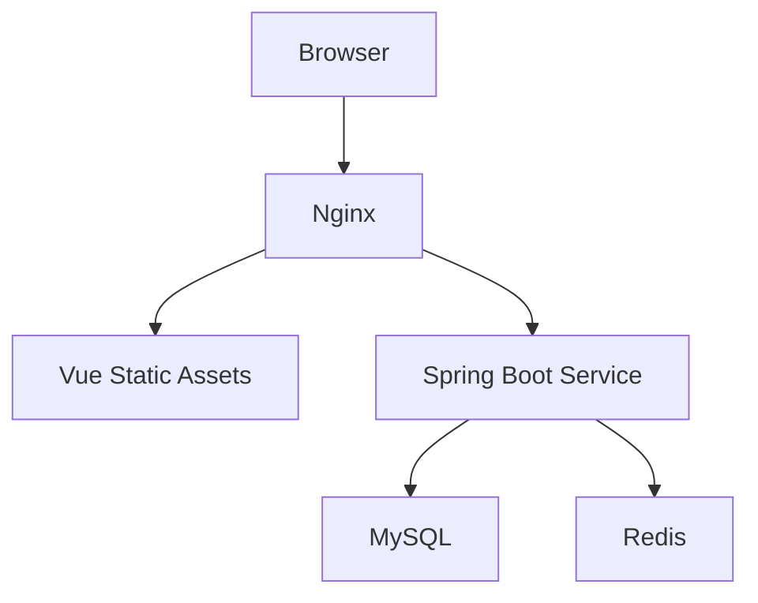

# 交付路线图

## 默认里程碑

### 第 1 阶段：工程骨架、鉴权与布局

目标：

1. 创建前端与后端工程骨架
2. 接通登录鉴权
3. 完成基础布局与动态菜单能力

默认交付：

- 前端基础框架、路由、状态管理、请求封装
- 后端基础工程、统一响应、异常处理、登录接口、权限基础设施
- Redis 登录态缓存

### 第 2 阶段：系统管理

目标：

1. 员工管理
2. 角色管理
3. 菜单管理
4. 权限控制

默认交付：

- 员工列表、新增、编辑、启停、角色分配、重置密码
- 菜单树与按钮权限
- 基础 RBAC 联调

### 第 3 阶段：基础资料

目标：

1. 租客管理
2. 房东管理

默认交付：

- 列表、详情、编辑、关联关系展示
- 与房源模块衔接所需的下拉、查询和关联接口

### 第 4 阶段：房源管理

目标：

1. 整租管理
2. 合租管理
3. 集中管理

默认交付：

- `house` 主模型 CRUD
- `house_room` 子模型维护
- 根据 `rental_mode` 提供差异化页面与查询
- 房源状态管理、租客绑定、出租率视图

### 第 5 阶段：工单与首页看板

目标：

1. 维修管理
2. 保洁管理
3. 首页图表

默认交付：

- 维修工单与保洁工单列表、创建、更新、状态流转
- 首页概览接口与趋势接口
- ECharts 基础图表展示

### 第 6 阶段：打磨与交付

目标：

1. 接口文档
2. 部署文件
3. 项目总结与补充说明

默认交付：

- Docker Compose 初版
- Nginx 反向代理说明
- MySQL / Redis / 前端 / 后端的部署关系说明
- 适合简历和演示的项目亮点总结

## 周计划建议

如果按 8 周推进，可默认采用以下节奏：

1. 第 1 周：骨架、登录、布局
2. 第 2 周：员工、角色、菜单权限
3. 第 3 周：租客、房东
4. 第 4 周：整租
5. 第 5 周：合租
6. 第 6 周：集中管理
7. 第 7 周：维修、保洁、首页
8. 第 8 周：联调、优化、部署、文档

## 验收检查清单

每完成一个阶段，至少检查以下项目：

1. 前后端目录结构是否仍然清晰
2. 接口前缀、响应结构、分页结构是否保持统一
3. 页面入口、菜单配置、权限码是否对齐
4. 数据表、实体、DTO、VO、前端表单字段是否一致
5. 关键功能是否能通过本地构建或最小人工验证

## 校验建议

如果项目已经具备可执行环境，优先运行最贴近真实交付的验证：

1. 前端构建，例如 `npm run build`
2. 后端编译或打包，例如 `mvn -DskipTests package`
3. 已有测试则执行测试，不要跳过现成的自动化校验

如果工具链尚未安装完成，则至少完成：

1. 代码结构自检
2. 路由、菜单、权限、接口的一致性检查
3. 关键 SQL、实体字段与前端表单字段比对

## 部署拓扑

部署关系默认如下：

Docker Compose 默认服务可包含：

1. `nginx`
2. `house-admin`
3. `house-service`
4. `mysql`
5. `redis`

## 简历向收尾建议

收尾时优先沉淀这些可展示成果：

1. RBAC、动态路由、按钮权限
2. 房源、租客、房东、工单的核心业务闭环
3. 首页看板与 Redis 登录态优化
4. 部署与项目总结文档

## 纵向切片标准

如果用户只要求某个局部模块，也按完整纵向切片交付，尽量覆盖：

1. 后端实体与接口
2. 前端页面与路由入口
3. 菜单和按钮权限
4. 关键状态与字典
5. 基础联调或构建验证

## 交付说明标准

交付说明默认应包含：

1. 实际完成了什么
2. 改动影响哪些目录或模块
3. 做过哪些验证
4. 还有哪些明确未完成项或依赖项
